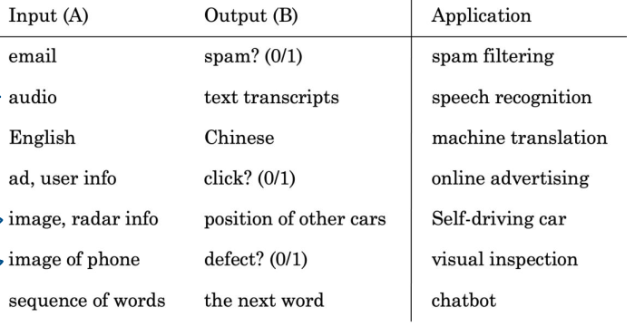
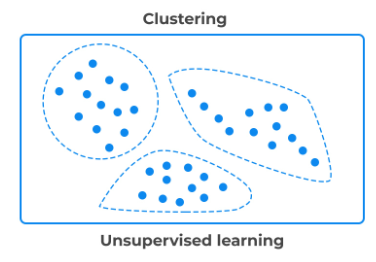
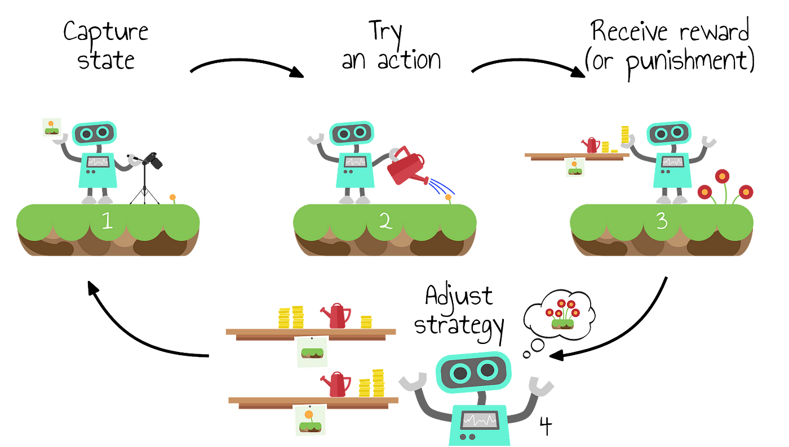

# Session 12: Data Wrangling I and Intro to AI

Welcome to Session 12! 🚀 <mark> Here, we start talking about Artificial Intelligence! That's really exciting, isn't it? 🤓  
Artificial Intelligence (AI) refers to the simulation of human intelligence 🧠 processes by machines, encompassing a wide range of techniques such as machine learning, natural language processing 💬, and computer vision 📸.
Have you ever wondered how AI is transforming the way we live and work? Share your thoughts and experiences as we embark on this journey together! 🤓😄

#### [Activity 12](https://docs.google.com/document/d/1DbocyxvRxT5m-GLqhri7XNpnVB8QHIIX/edit?tab=t.0#heading=h.gjdgxs)

#### AI Types  
- ANI (Artificial Narrow Intelligence)
- Generative AI (Generative Artificial Intelligence)
- AGI (Artificial General Intelligence)

#### Machine Learning Processes  
- Prepare Data
- Train
- Evaluate
- Deploy

#### Machine Learning Techniques
- Supervised Learning 
- Unsupervised Learning 
- Reinforcement Learning 
  
- Deep Learning 

