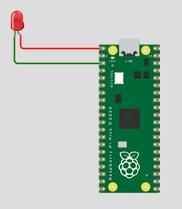

# Session 18: Intro to Computer Architecture and Digital Logic & Intro to Embedded Systems and Robotics

Welcome to Session 18! 🚀
Let's break down the title one by one <br>
## Computer Architecture 
Have you ever wondered about computer architecture? The term 'architecture' might remind you of buildings and cities, but computers have their own intricate designs and structures, too.
The architecture of most modern computers is **Multicore and Multiprocessor System**
A multi-core processor is a single computing component with two or more independent actual central processing units called "cores", which are the units that read and execute program instructions. 


#### [Activity 18](https://docs.google.com/document/d/1whsDDv8SARYCyW8M1L6KFacWVLlY8fAGmRXpvECq6-A/edit?usp=sharing)


#### Computations (Processors)
> This component performs calculations, which is how the system transforms inputs into outputs.
- Windows (cmd): 
	- To get information about the cpu : run ```  
wmic cpu get```
	- To get information about the number of CPU Cores:<br> `wmic cpu get NumberOfCores``
	- To get information about the number of Logical Processors:<br> `wmic cpu get NumberOfLogicalProcessors``
- Linux (Bash)
	- To get information about the cpu : run ```bash 
lscpu```
	- To get information about the number of cores (physical and virtual cores , if hyper-threading is enabled):<br>
 `nproc --all`
	

#### Memory and Storage
> The ability to store information for some time and retrieve it when needed.
##### Memory (Short term):
- information that is stored for seconds to several hours (or more)
- The hardware component responsible for short-term memory in the computer is **random access memory (RAM)**, also referred to as main memory.
- Information stored in RAM can be retrieved quickly and is used to store information related to programs that are running on a computer.
- RAM is considered volatile because it requires power to work and is deleted whenever the computer loses power.
- RAM is currently measured in gigabytes (GB), and you'll find that it comes in powers of 2. <br>
<mark>If a program is running slowly, one of the first things you can do is close other programs or restart your computer. This frees up memory and may get the program to run more quickly.</mark> <br>
- Windows (cmd): 
	- to gather the necessary information about your pc's memory:
		```msinfo32```
- Linux (Bash):
	- to get a lot of information about the **machine’s hardware** - including processors, memory, networking, and more:
	```bash
	lshw
	```
	- to gather the necessary information about your **pc's memory**:
	```bash
	lshw -c memory
	```
	- To get GB, we need to multiply the number of GiB by ***1.074***
	


##### Storage (long term):
- information that is stored for days, weeks, months, and even many years 
- This type of non-volatile storage is called a hard drive, and there are two categories:
	- Hard Disk Drives (HDD)
	- Solid-state drives (SSD)
##### Hard Disk Drives
- Hard disk drives are also sometimes referred to as mechanical or magnetic hard disks since they use magnets and spinning platters to store data, similar to how a record player plays music.
- These hard drives are cheaper than solid-state drives of the same size, but with moving parts are more likely to break over time.
- The more rotations per minute a drive has, the faster the drive can be accessed.

##### Solid State Drives
- Unlike HDDs, solid-state drives have no moving parts. Instead, they use integrated circuits to store data
- they require less power and produce less heat than mechanical hard drives
- They are faster than HDDs and are typically more expensive for the same amount of storage

- Windows (cmd): 
	- to get information about block devices (such as disks and partitions), the diskpart command-line utility is used
		- In the cmd.exe run : `diskpart` (This launches the diskpart command-line tool)
		- To list all disks: Type `list disk` and press Enter. This will display a list of all physical disks connected to your system.
		- To list all volumes (partitions): Type `list volume` and press Enter. This will show all volumes (partitions) on all disks.

- Linux (Bash):
	- to get a lot of information about the machine’s storage blocks:
	```bash
	lsblk
	```

#### Motherbaord
> The motherboard is the primary circuit board in the computer to which all other components are connected
- It is sometimes referred to as the main circuit board or the logic board.
- The motherboard contains slots for RAM (typically 4), the ability to connect the internal hard drive, and other internal and external components.

#### Network Interface Controller (NIC)
> Network connectivity has become standard, and many motherboards now have an integrated network controller.

#### Graphics Card / GPU
> a specific component that handles graphics processing
- have a separate processing unit specific to graphics and are known as a graphics processing unit or GPU
- limits the graphics processing load on the CPU and makes the computer run faster when performing graphic-intensive activities.

#### Ports
- USB A
- USB Mini
- USB C
- USB Micro 
- HDMI
- Ethernet

#### Network and Network Speed
- The cables or wireless connection is called the physical medium of the network.
- The network speed measures how much data, in bits, can be transmitted from source to destination per second.
- 1 Kilobyte is about 150 words of data
- The delay introduced in computer networks from the physical medium, routing, and distance the data travels is called latency.
- internet speed is a measurement of how much data is sent over a network per second and is measured in Kilobits per second (Kbps), Megabits per second (Mbps), and Gigabits per second (Gbps).

<mark>
- We measure the amount of data in bytes.
- We measure the speed of data transmission in bits.
</mark>


- To test the speed of your network : https://www.speedtest.net/
- Linux (Bash): run `speedtest`

### Instruction Cycle
#### Fetch 
> find the instruction for which calculation to perform next
#### Decode
> determine what the instruction is, and what other data is necessary
#### Execute
> perform the calculation


## Embedded System 
### What is embedded system? An embedded system is a computer system that is designed for **a specific task**, as opposed to a general-purpose computer system, which is designed to perform any task.
### Advantages of Embedded Systems:
- Cost : more economical
- Resource Constraints (fewer resources)
- Performance (fast)
### Disadvantages of Embedded Systems:
- Specialization : Hardware engineers must work together with software engineers to design and program a new embedded system
- Constraints : not flexible enough to handle new challenges. Because designers constrained embedded systems to the minimum cost, size, and resources necessary to handle a specific task, when a new challenge arises, the existing embedded system is often insufficient for the new task.


#### Connecting LEDS


you'll connect an LED light to a simulated Raspberry Pi embedded system.

1. Visit https://wokwi.com/projects/new/micropython-pi-pico(opens in a new tab)
2. Visit raspberrypi.com(opens in a new tab) to view the pinout diagram(opens in a new tab) for the Raspberry Pi Pico
3. Add an LED
4. Connect the LED negative lead to a ground pin of the Raspberry Pi. (Negative leads are shorter than positive leads.) (Ground pins are prefixed with “GND”.)
5. Connect the LED positive lead to a general purpose input-output (GPIO) pin of the Raspberry pi. (Positive leads are longer.) (GPIO pins are prefixed with “GP”.)
6. Positive wires are typically covered with red coating, so color the positive wire red.

### Using Python to program RasberryBi:
#### Libraries to import
- `from machine import Pin` : This allows us to declare and initialize Raspberry Pi Pico pins as objects in our code.
- `from utime import sleep` : This allows us to pause the system in its current state for a specified period of time

#### utilizing pin 2 as output : 
```python
from machine import Pin
my_pin = Pin(2, Pin.OUT)
```
#### Pause the system in its current state for a specified period of time
```python
from utime import sleep
sleep(0.5)  #don't do anything for 0.5 second
```


